# Cloud Computing Internship Portfolio

## Overview

This repository contains the projects completed during my Cloud Computing Internship. The projects cover fundamental Linux administration, web server deployment, Git and GitHub, Docker, containerization, CI/CD, Kubernetes, and system monitoring.

## Technologies Used

- Ubuntu Server
- VirtualBox
- Nginx
- Git & GitHub
- Docker
- Docker Compose
- GitHub Actions
- Kubernetes
- Minikube
- Prometheus
- Grafana

---

# Project 1 — Ubuntu Server & Nginx

In Project 1, I worked with Ubuntu Server in VirtualBox and configured a web server using Nginx. I also worked with networking and static IP configuration before deploying a simple webpage.

### Evidence

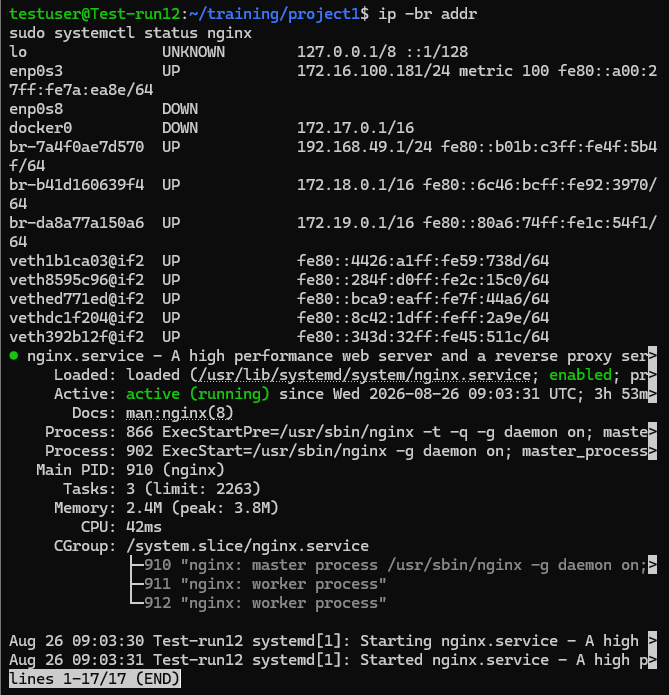

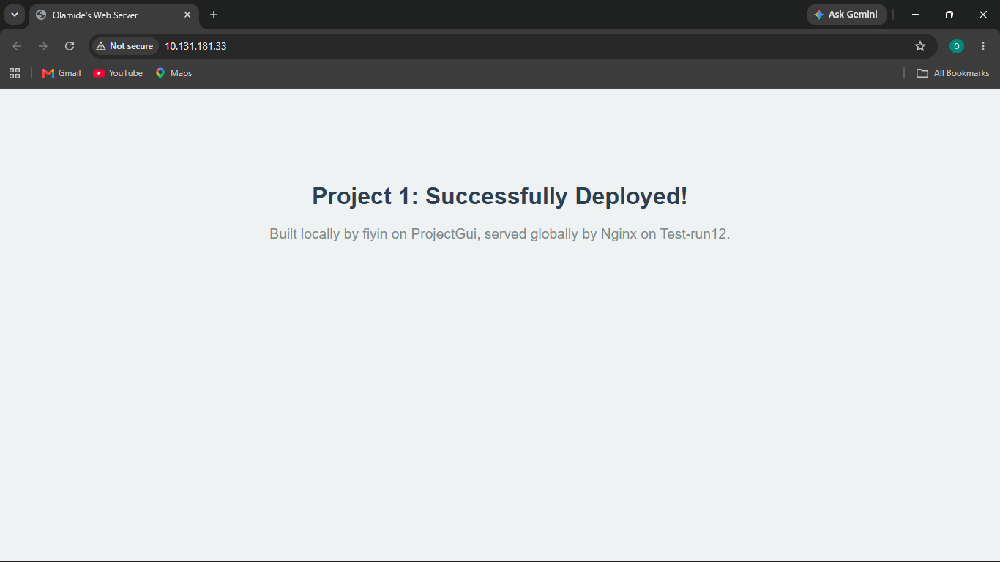

---

# Project 2 — Git & GitHub

Project 2 introduced version control using Git and GitHub. I created and managed a repository, worked with branches, committed changes, and pushed the project to GitHub.

### Evidence

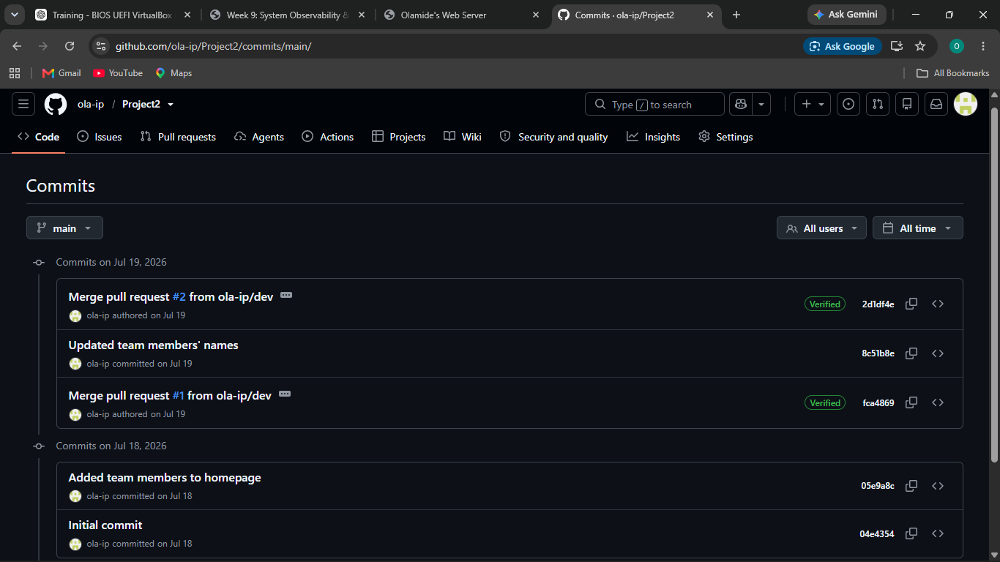

---

# Project 3 — Docker

In Project 3, I learned the fundamentals of Docker by creating a Dockerfile and deploying an Nginx web application inside a container. I also worked with Docker images, containers, ports, and container logs.

### Evidence

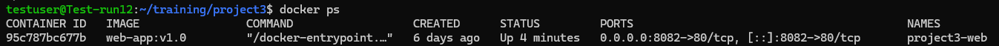

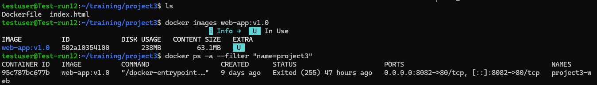

---

# Project 4 — Docker Compose

Project 4 focused on Docker Compose and multi-container applications. I created a Compose configuration to manage multiple services and worked with environment variables and persistent storage.

### Evidence

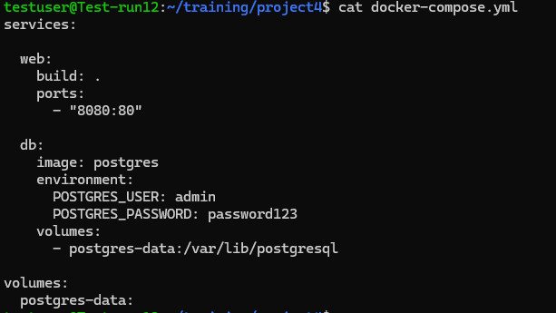

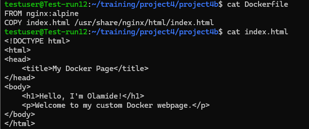

---

# Project 5 — Docker Volumes & Networking

Project 5 focused on Docker data persistence and container networking. I worked with Docker volumes to preserve application data and explored how containers communicate within Docker networks.

### Evidence

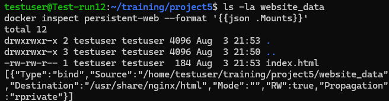

---

# Project 6 — Custom Docker Image

Project 6 involved creating a custom Docker image using a Dockerfile and serving a custom webpage through an Nginx container.

### Evidence

---

# Project 7 — GitHub Actions & CI/CD

Project 7 introduced Continuous Integration and Continuous Deployment using GitHub Actions. I created an automated workflow and used GitHub Actions to verify project changes through a successful workflow run.

### Evidence

---

# Project 8 — Kubernetes & Minikube

Project 8 introduced Kubernetes and Minikube. I deployed workloads, managed Kubernetes pods, and demonstrated Kubernetes self-healing by deleting a pod and observing it being automatically recreated.

### Evidence

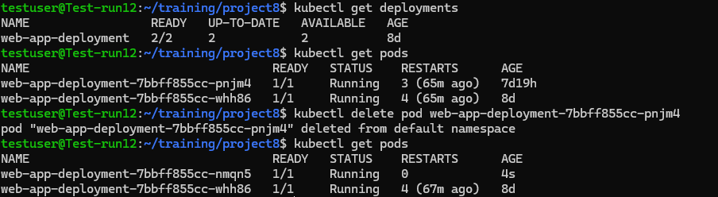

---

# Project 9 — System Observability & Monitoring

Project 9 focused on system observability and monitoring using Prometheus and Grafana.

I deployed Prometheus and Grafana using Docker Compose, connected Prometheus as a Grafana data source, and created a Grafana dashboard to visualize Prometheus metrics.

### Evidence

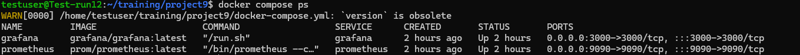

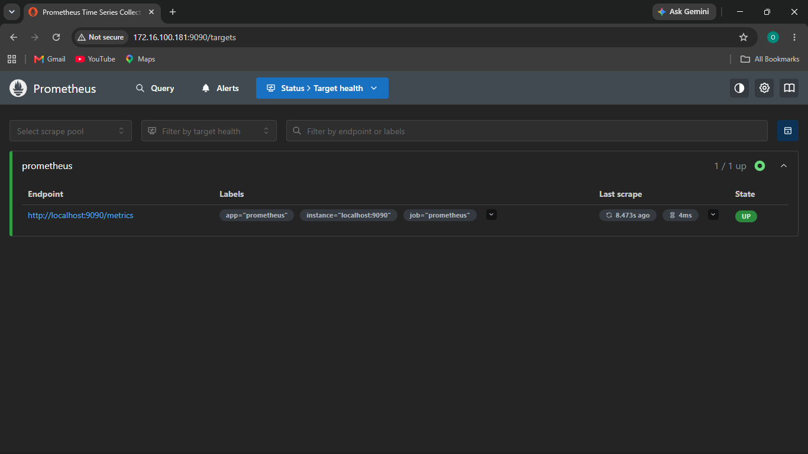

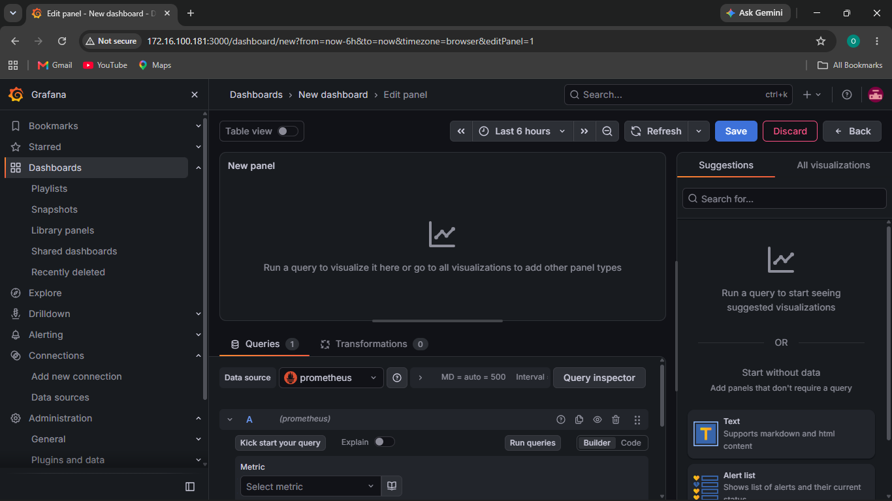

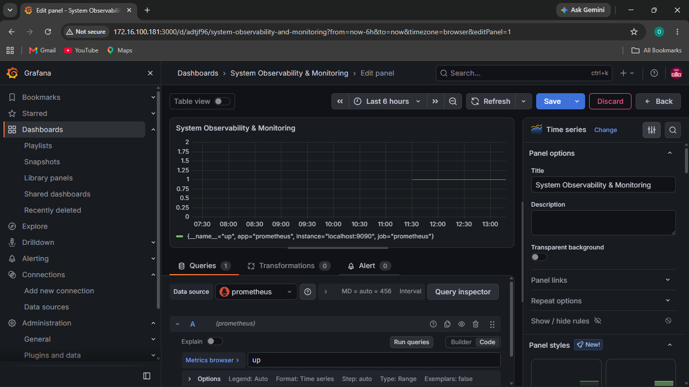

---

# Skills Demonstrated

Through these projects, I gained practical experience with:

- Linux server administration
- Virtual machine configuration
- IP addressing and networking
- Nginx web server deployment
- Git and GitHub
- Docker containers and images
- Docker Compose
- Docker volumes and networking
- CI/CD with GitHub Actions
- Kubernetes and Minikube
- Container orchestration
- Prometheus monitoring
- Grafana dashboards
- System observability

# Conclusion

These projects provided hands-on experience with modern cloud computing and DevOps technologies. The progression from Linux and web server configuration through containerization, CI/CD, Kubernetes, and monitoring helped develop a practical understanding of deploying, managing, automating, and monitoring applications in cloud-oriented environments.
